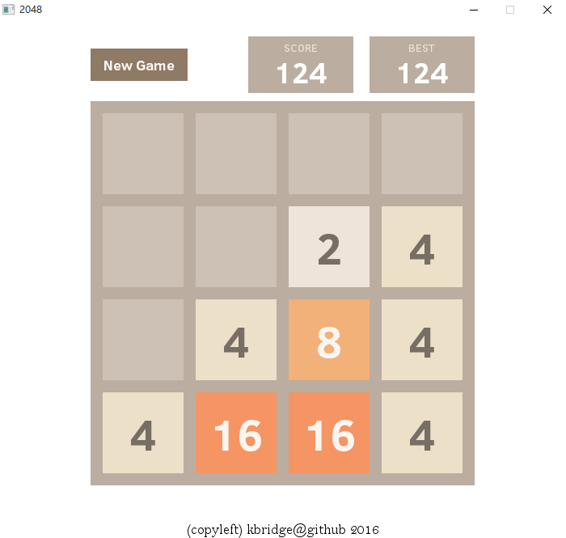

# SDL2048

Origin 2048 clone in C++ &amp; SDL.

## Features
* Written in C++ completely
* With __animation__!

## Try
Still under construction.

You can try the [demo](https://github.com/kbridge/SDL2048/raw/master/Executable/SDL2048.zip) (win32).

## Developers
* Install [SDL2](http://libsdl.org/download-2.0.php), [SDL2\_image](https://www.libsdl.org/projects/SDL_image/), [SDL2\_ttf](https://www.libsdl.org/projects/SDL_ttf/) development libraries
* Change Include Directories & Library Directories
* Use the Release configuration if you want to publish your binaries

## Reference
* The [origin 2048](https://github.com/gabrielecirulli/2048) written in HTML5+CSS3
* [Timing Functions in CSS Transitions](https://www.w3.org/TR/2012/WD-css3-transitions-20120403/#transition-timing-function)
* [Unit Cubic Bezier Curve Solving](https://github.com/WebKit/webkit/blob/67985c34ffc405f69995e8a35f9c38618625c403/Source/WebCore/platform/graphics/UnitBezier.h)

kbridge
